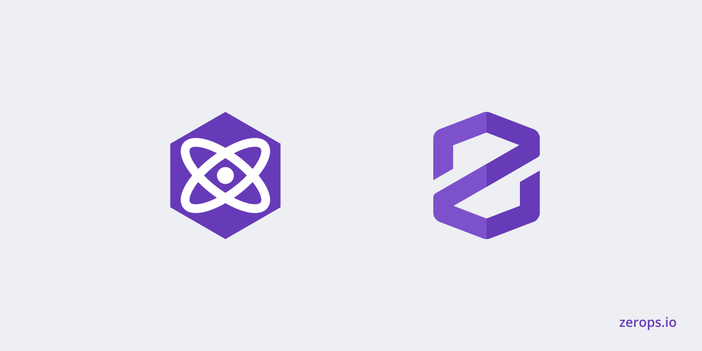

# Zerops x Preact - Static



A Static Preact app deployment example for [Zerops](https://zerops.io) - a developer first cloud platform.

## Deploy to Zerops

1. [Create an account](https://app.zerops.io/registration) and locate the "Import project" button in the top left menu.
2. Copy & paste the YAML setup below and confirm

```yaml
project:
  name: preact

services:
  - hostname: preactstatic
    type: nginx@1.22
    nginxConfig: |-
      server {
          listen 80 default_server;
          listen [::]:80 default_server;

          server_name _;
          root /var/www;

          location / {
              try_files $uri $uri/ /index.html;
          }

          access_log syslog:server=unix:/dev/log,facility=local1 default_short;
          error_log syslog:server=unix:/dev/log,facility=local1;
      }
    buildFromGit: https://github.com/fxck/zerops-preact-static
    enableSubdomainAccess: true
    minContainers: 1
```

If you still find yourself stuck in the process join our [Discord community](https://discord.com/invite/WDvCZ54).